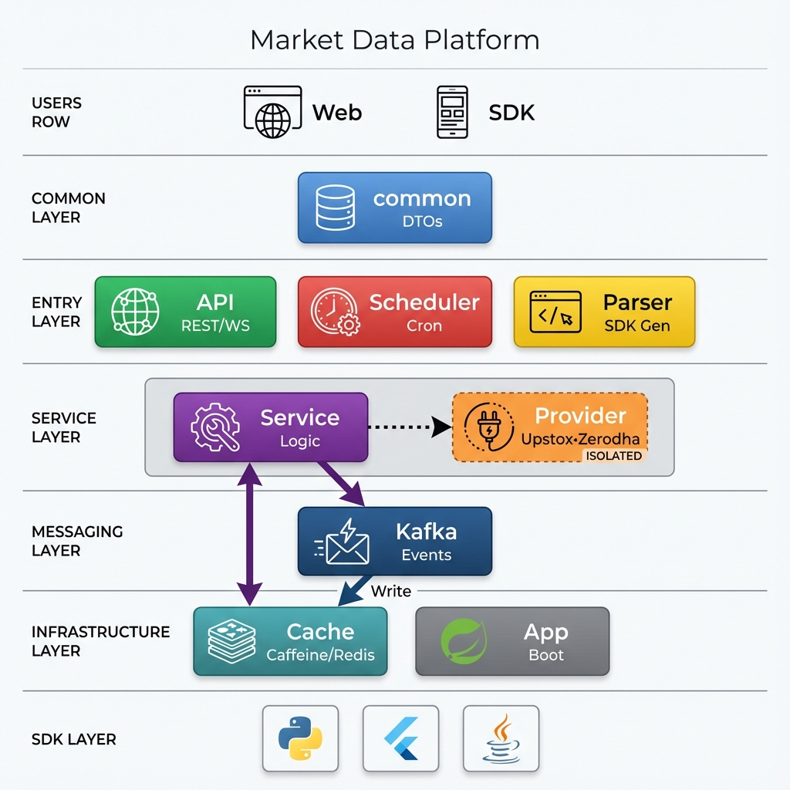

# Market Data Refactoring Plan - Architecture v2 Alignment (Intelligence-Driven)

**Date**: 2025-12-27  
**Approach**: Analyze actual codebase → Make informed decisions → Execute  
**Timeline**: Flexible based on discoveries

## Reference Architecture



## Implementation Philosophy

🧠 **INTELLIGENCE-DRIVEN**: This plan provides OBJECTIVES and DISCOVERY STEPS, not code snippets.  
✅ Analyze actual code before acting  
✅ Make informed decisions based on what exists  
✅ Adapt plan based on discoveries  
❌ DO NOT blindly copy-paste code

⚠️ **CRITICAL - External JARs**: 
- Recognize external library imports (`io.swagger.*`, `com.upstox.api.*`, etc.)
- These are from Maven dependencies, NOT project code
- DO NOT try to recreate them - reference via pom.xml
- Search project source to confirm: `grep_search "package io.swagger"` → No results = JAR

---

## Quick Status

**Current State**:
- ✅ 6 modules aligned with architecture
- 🔄 2 modules need cleanup (service, sdk)  
- ⭐ 1 new module to create (provider)
- ✅ ALL existing modules kept

**Target**:
1. Extract provider code → new `market-data-provider`
2. Clean `market-data-service` → pure business logic
3. Enhance `market-data-parser` → OpenAPI + SDK generation
4. Add auto-configuration → all modules self-contained

---

## PHASE 0: Discovery & Analysis

### Objective
Understand current codebase structure before making changes.

### Discovery Steps

#### 0.1 Find All Provider-Related Code

```powershell
# Find Upstox files
find_by_name -Pattern "*Upstox*" -Extensions ["java"] -SearchDirectory "market-data-service/src"

# Find Zerodha files  
find_by_name -Pattern "*Zerodha*" -Extensions ["java"] -SearchDirectory "market-data-service/src"

# Search for Provider implementations
grep_search "implements.*Provider" -SearchPath "market-data-service" -MatchPerLine true

# Find external API dependencies
grep_search "import.*upstox|import.*zerodha|import.*kiteconnect" -MatchPerLine true
```

#### 0.2 Analyze Each File

For each found file:
1. **View content**: `view_file` to understand purpose
2. **Classify**: 
   - Pure provider code (SDK wrapper)?
   - Mixed (business logic + provider)?
   - Configuration?
   - Data models?
3. **Check dependencies**: What does it import? What imports it?

#### 0.3 Map Current Structure

Create mental map:
```
market-data-service/
├── Provider Code (TO MOVE)
│   ├── Upstox: Services, Config, Models
│   ├── Zerodha: Services, Config, Models
│   └── Common: Provider factory, interfaces
├── Business Logic (TO KEEP)
│   ├── MarketDataFetchService
│   ├── MarketDataPollingService
│   └── BrokerageCalculator
└── Mixed Code (TO REFACTOR)
    └── Services using providers directly
```

#### 0.4 Decision Criteria

Before moving any file, ask:
- **Is it provider-specific?** → Move to provider
- **Does it contain business rules?** → Keep in service, refactor to use interface
- **Is it shared across providers?** → Move to common
- **Is it purely config?** → Move to provider config package

### Outputs Needed

- [ ] List of files to move (pure provider code)
- [ ] List of files to refactor (mixed code)
- [ ] List of dependencies to update
- [ ] Current `MarketDataProvider` interface location (if exists)

---

## PHASE 1: Create Provider Module Structure

### Objective
Set up `market-data-provider` module with proper structure and dependencies.

### Steps

#### 1.1 Analyze Existing Interface

```
# Check if MarketDataProvider interface exists
grep_search "interface MarketDataProvider" -SearchPath "market-data-service"

# If found, view it
view_file <path-to-interface>

# Decision: Use existing or create new?
```

#### 1.2 Create Module Structure

**Only create if analysis confirms need**:

```powershell
# Basic structure
New-Item -ItemType Directory -Path "market-data-provider/src/main/java/com/am/marketdata/provider"
New-Item -ItemType Directory -Path "market-data-provider/src/main/resources/META-INF"
New-Item -ItemType Directory -Path "market-data-provider/docs"
```

#### 1.3 Define pom.xml

**Dependencies to include** (based on discovery):
- ✅ market-data-common
- ✅ Spring Boot Starter
- ✅ Provider SDKs (upstox, zerodha) - check versions currently used
- ❌ NO market-data-service
- ❌ NO market-data-api

```powershell
# Check current SDK versions
grep_search "upstox-java-sdk|kiteconnect" -SearchPath "pom.xml" -MatchPerLine true
```

#### 1.4 Create/Move Provider Interface

**If interface exists in service**:
- Copy to provider module
- Update package name
- Keep in service temporarily (remove later)

**If no interface exists**:
- Review existing provider implementations
- Extract common contract
- Create interface based on actual methods used

### Verification

- [ ] Module compiles independently
- [ ] No circular dependencies
- [ ] Interface can be implemented by Upstox/Zerodha

---

## PHASE 2: Move Provider Implementations

### Objective
Relocate all provider-specific code to `market-data-provider`.

### Discovery-Based Execution

#### 2.1 Identify Files to Move

**For each provider (Upstox, Zerodha)**:

```
1. List all files:
   find_by_name -Pattern "*<Provider>*"

2. For each file, determine:
   - Is it a model/DTO? → Check if provider-specific or common
   - Is it a service? → Check if pure provider or has business logic
   - Is it config? → Provider config or app config?
   - Is it a repository? → Check what data it accesses

3. Classify as:
   - MOVE: Pure provider code
   - REFACTOR: Mixed code (separate concerns first)
   - KEEP: Business logic or common code
```

#### 2.2 Move Pure Provider Code

**Pattern**:
```powershell
# For each file classified as MOVE:
# 1. Create target directory if needed
# 2. Copy file (don't move yet - keep backup)
# 3. Update package declaration
# 4. Fix imports
# 5. Verify compiles
# 6. Run tests
# 7. Delete original only after verification
```

#### 2.3 Refactor Mixed Code

**For files with both business + provider logic**:

1. **Analyze dependencies**:
   ```
   # What does it import from provider?
   grep "import.*upstox|import.*zerodha"
   ```

2. **Separate concerns**:
   - Extract provider calls → move to provider module
   - Keep business logic → stays in service
   - Use interface for communication

3. **Example pattern** (instruction, not code):
   - Service calls `provider.getQuotes()` (interface)
   - Provider module implements the call
   - NO direct Upstox/Zerodha imports in service

#### 2.4 Update Resources

**Check for provider-specific resources**:
```powershell
# Find JSON, config files
find_by_name -Pattern "*upstox*|*zerodha*" -Extensions ["json", "properties", "yml"]

# Analyze each:
view_file <path>

# Decision: Move to provider/src/main/resources or keep?
```

### Verification

After each file move:
- [ ] Provider module compiles
- [ ] Service module still compiles  
- [ ] No broken imports
- [ ] Tests still pass (or are moved with code)

---

## PHASE 3: Clean Service Module

### Objective
Remove ALL provider-specific code from `market-data-service`. Pure business logic only.

### Discovery Steps

#### 3.1 Find Remaining Provider References

```powershell
# Search for provider imports
grep_search "import.*provider.*upstox|import.*provider.*zerodha" -SearchPath "market-data-service"

# Search for direct provider class usage
grep_search "new Upstox|new Zerodha" -SearchPath "market-data-service"

# Find provider SDK imports
grep_search "import io.swagger.v3.oas.annotations.*upstox" -SearchPath "market-data-service"
```

#### 3.2 Refactor Services to Use Interface

**For each service using providers**:

1. **Identify current usage**:
   ```
   view_file <service-file>
   # Look for: Direct provider class references
   ```

2. **Refactor pattern**:
   - Change: `UpstoxApiService upstoxService`
   - To: `MarketDataProvider provider` (interface)
   - Inject via constructor or @Autowired

3. **Remove provider-specific logic**:
   - If service has Upstox-specific code → move to UpstoxMarketDataProvider
   - Keep only: Validation, orchestration, caching, business rules

#### 3.3 Update Dependencies (pom.xml)

```powershell
# Check current dependencies
view_file "market-data-service/pom.xml"

# Remove:
- Any direct provider SDK dependencies (upstox-java-sdk, kiteconnect)
- Provider-specific libraries

# Keep/Add:
- market-data-provider (interface only)
- market-data-common
- market-data-api
```

#### 3.4 Verify Clean Separation

**Tests**:
```powershell
# No provider SDK imports in service
grep_search "upstox.*sdk|zerodha.*kite" -SearchPath "market-data-service/src"
# Should return: No results

# Only interface usage
grep_search "MarketDataProvider" -SearchPath "market-data-service/src"
# Should return: Interface references only, no implementations
```

### Verification

- [ ] Service has ZERO provider SDK dependencies
- [ ] Services use `MarketDataProvider` interface
- [ ] Service compiles without provider module
- [ ] All tests pass

---

## PHASE 4: Add Auto-Configuration to All Modules

### Objective
Each module self-configures via Spring Boot auto-configuration.

### Pattern (Apply to Each Module)

#### 4.1 Identify Module's Beans

For each module:
```
1. Find all @Service, @Component, @Repository classes
   grep_search "@Service|@Component|@Repository"

2. Find all @Bean definitions
   grep_search "@Bean"

3. Determine: What beans does this module provide?
```

#### 4.2 Create Auto-Configuration Class

**Template** (instruction, not exact code):

```
Location: {module}/src/main/java/com/am/marketdata/{module}/config/{Module}AutoConfiguration.java

Content:
- @Configuration
- @ComponentScan(basePackages = "com.am.marketdata.{module}")
- @EnableConfigurationProperties for module properties
- @Bean methods for module-specific beans
- @Conditional annotations for optional features
```

#### 4.3 Create Properties Class (if needed)

```
If module needs externalized config:
- Create {Module}Properties.java
- @ConfigurationProperties(prefix = "{module}")
- Define all configurable properties
```

#### 4.4 Register Auto-Configuration

**File**: `src/main/resources/META-INF/spring.factories`

```
org.springframework.boot.autoconfigure.EnableAutoConfiguration=\
com.am.marketdata.{module}.config.{Module}AutoConfiguration
```

### Modules to Configure

Apply to:
- [ ] market-data-provider (conditional Upstox/Zerodha)
- [ ] market-data-service
- [ ] market-data-api
- [ ] market-data-scheduler
- [ ] market-data-kafka
- [ ] market-data-redis
- [ ] market-data-parser
- [ ] market-data-scraper (conditional)
- [ ] market-data-external-api (conditional)
- [ ] market-data-internal
- [ ] market-data-processor
- [ ] market-data-sdk

### Verification

For each module:
- [ ] Has {Module}AutoConfiguration.java
- [ ] Has spring.factories registration
- [ ] Scans ONLY its own packages
- [ ] Properties externalized
- [ ] Loads automatically when on classpath

---

## PHASE 5: Update Parser Module

### Objective
Add Service → Parser connection for SDK generation.

### Discovery

#### 5.1 Analyze Current SDK Structure

```powershell
# Check what exists
list_dir "market-data-sdk"

# Find SDK generation scripts
find_by_name -Pattern "generate*" -Extensions ["ps1", "sh"]

# View current approach
view_file "market-data-sdk/generate_sdks.ps1"
```

#### 5.2 Determine Enhancement Needed

**Questions to answer**:
1. Where is OpenAPI spec generated? (API or Service module?)
2. How is spec currently fed to SDK generator?
3. Is there a Parser abstraction or direct script?

#### 5.3 Create Service → Parser Connection

**Pattern**:
- Service exposes OpenAPI spec endpoint
- Parser reads spec
- Parser triggers SDK generation
- Parser packages SDKs

**Implementation depends on discovery** - analyze existing code to determine best approach.

### Verification

- [ ] Service can provide OpenAPI spec
- [ ] Parser can consume spec
- [ ] SDK generation works
- [ ] Generated SDKs are valid

---

## PHASE 6: Final Verification

### Compilation Tests

```bash
# Compile each module independently
mvn clean compile -pl market-data-provider
mvn clean compile -pl market-data-service
# ... for each module

# Full build
mvn clean install
```

### Dependency Verification

```powershell
# Check no circular dependencies
mvn dependency:tree > deps.txt

# Verify provider isolation
grep_search "upstox-java-sdk|kiteconnect" -SearchPath "market-data-service/pom.xml"
# Should return: No results (only in provider module)
```

### Runtime Tests

```bash
# Start application
mvn spring-boot:run -pl market-data-app

# Verify modules loaded
# Check logs for: "Configuring {Module}"

# Test provider switching
# Change provider.type in application.yml
# Restart and verify different provider loaded
```

### Architecture Compliance

- [ ] API has NO service dependencies
- [ ] Service has NO provider SDK dependencies
- [ ] Provider is ISOLATED
- [ ] Each module self-configures
- [ ] App module is MINIMAL (just launcher)

---

## Rollback Strategy

If issues occur:
1. Git branch for each phase
2. Commit after each successful step
3. Rollback: `git reset --hard <last-good-commit>`
4. Retry with adjusted approach

---

## Success Criteria

✅ **Architecture Aligned**: Modules match diagram v2  
✅ **Clean Separation**: No code violations  
✅ **Self-Contained**: Each module auto-configures  
✅ **Provider Isolated**: Can swap providers via config  
✅ **Compilable**: All modules build independently  
✅ **Testable**: Tests pass  
✅ **Runnable**: Application starts successfully  

---

## Notes

- This plan is GUIDANCE, not prescription
- Analyze code before each action
- Adapt based on discoveries
- Document decisions made
- Update this plan as you learn more about the codebase
